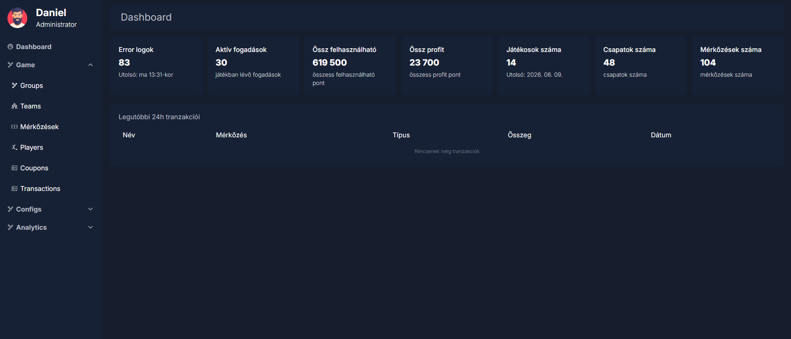
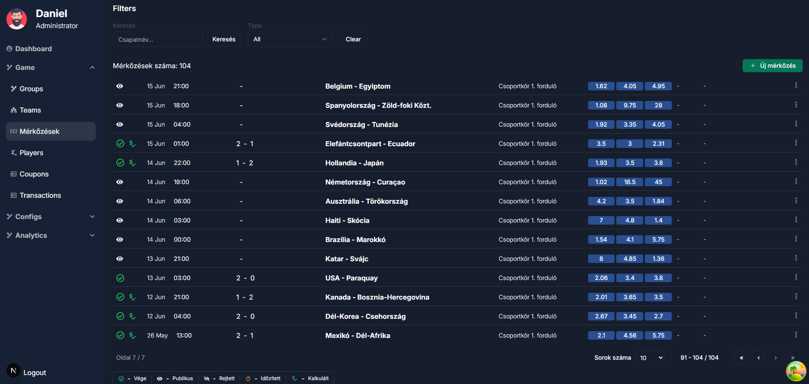
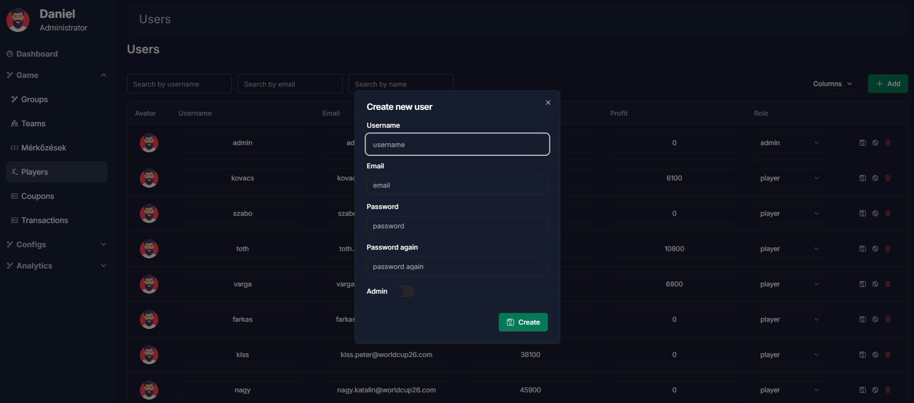
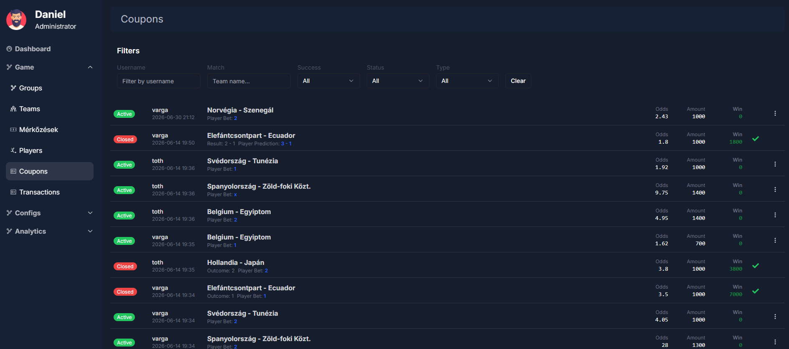

# Mokasfoci Admin UI

Admin dashboard for **Mokasfoci** — a World Cup 2026 football prediction / betting game. This app is the back-office panel used to manage teams, groups, matches, users, coupons, transactions and system operations for the game.

Built with [Next.js](https://nextjs.org/) (App Router), TypeScript, Tailwind CSS, and [shadcn/ui](https://ui.shadcn.com/) components.

## Screenshots

| Dashboard | Matches |
| --- | --- |
|  |  |

| Users | Coupons |
| --- | --- |
|  |  |

## Features

- **Authentication** — cookie-based session, protected `/dashboard/*` routes via [middleware.ts](middleware.ts)
- **Teams** — manage World Cup teams
- **Groups** — manage tournament groups
- **Matches** — create, update and track match fixtures and results
- **Users** — manage player accounts and validate user scores
- **Coupons** — manage prediction coupons
- **Transactions** — view and manage user transactions
- **Statistics** — dashboard stats and reporting
- **Notifications** — send system chat messages / notifications to specific users or all players
- **Operations** — administrative tools such as game reset and scheduler status
- **Logs** — view system/audit logs
- **Settings** — application configuration

## Tech Stack

- [Next.js 16](https://nextjs.org/) (App Router)
- [React 19](https://react.dev/) + TypeScript
- [Tailwind CSS](https://tailwindcss.com/) with [shadcn/ui](https://ui.shadcn.com/) (Radix UI primitives)
- [TanStack Query](https://tanstack.com/query) for server state
- [TanStack Table](https://tanstack.com/table) for data tables
- [React Hook Form](https://react-hook-form.com/) + [Zod](https://zod.dev/) for forms and validation
- [Zustand](https://zustand-demo.pmnd.rs/) for client state
- [Axios](https://axios-http.com/) for API requests
- [Recharts](https://recharts.org/) for charts
- [Playwright](https://playwright.dev/) for end-to-end tests

## Getting Started

### Prerequisites

- Node.js 18+
- A running instance of the Mokasfoci API backend

### Installation

```bash
npm install
# or
yarn install
```

### Environment Variables

Create a `.env.local` file in the project root with the following variable:

```bash
NEXT_PUBLIC_API_URL=http://localhost:PORT   # Base URL of the Mokasfoci API
```

### Development

```bash
npm run dev
# or
yarn dev
```

Open [http://localhost:3000](http://localhost:3000) with your browser to see the result.

## Available Scripts

| Script            | Description                                  |
| ------------------ | --------------------------------------------- |
| `npm run dev`      | Start the development server                  |
| `npm run build`    | Create a production build                      |
| `npm run start`    | Start the production server                     |
| `npm run lint`     | Run ESLint                                      |
| `npm run test`     | Run Playwright end-to-end tests                 |
| `npm run deploy`   | Build and deploy to the configured host (see [deploy.sh](deploy.sh)) |

## Project Structure

```
app/
  dashboard/        # Protected admin pages (teams, groups, matches, users, coupons, transactions, statistics, operations, logs, settings)
  login/             # Login page
  ui/                # Shared UI building blocks (dashboard, global, login)
components/          # Reusable shadcn/ui-based components
services/            # API service layer (axios calls per domain) and types
store/               # Zustand stores
hooks/               # Custom React hooks
lib/                 # Shared utilities
util/                # App config, axios instance, enums, responsive helpers
enums/               # Shared enums
types/               # Shared TypeScript types
tests/               # Playwright end-to-end tests
docs/                # Documentation assets (e.g. screenshots)
middleware.ts        # Route protection for /dashboard/*
```

## Deployment

The [deploy.sh](deploy.sh) script builds the project and deploys it to a remote host over `rsync`/`ssh`, restarting the app with [PM2](https://pm2.keymetrics.io/). Update the `REMOTE_USER`, `REMOTE_HOST` and `REMOTE_PATH` variables in the script to match your environment before running:

```bash
npm run deploy
```

## Testing

End-to-end tests are written with Playwright:

```bash
npm run test
```
